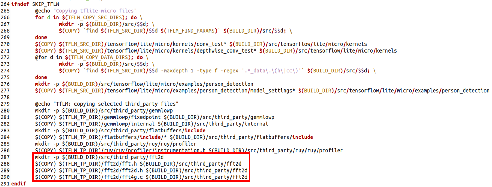
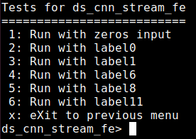
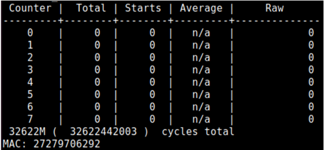
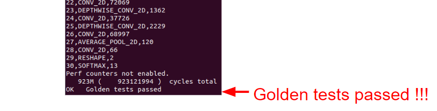

Lab1: CFU-Playground Environment Setup & Porting KWS model
==========================================================

Goals of this lab
-----------------

-  `Set up CFU-Playground environment. -20% <#cfu-playground-environment-setup-20>`__
-  `Porting KWS model into CFU-Playground. -60% <#porting-kws-model-60>`__
-  `Measuring how much MAC and DRAM space of KWS model use. -20% <#measuring-how-much-mac-and-dram-space-of-kws-model-use-20>`__

--------------

CFU-Playground Environment Setup -20%
-------------------------------------

`Setup Guide <https://cfu-playground.readthedocs.io/en/latest/setup-guide.html>`__
~~~~~~~~~~~~~~~~~~~~~~~~~~~~~~~~~~~~~~~~~~~~~~~~~~~~~~~~~~~~~~~~~~~~~~~~~~~~~~~~~~

1. Prepare a supperted board (We use Nexys A7-100T)
^^^^^^^^^^^^^^^^^^^^^^^^^^^^^^^^^^^^^^^^^^^^^^^^^^^

2. Clone the CFU-Playground Repository from the github
^^^^^^^^^^^^^^^^^^^^^^^^^^^^^^^^^^^^^^^^^^^^^^^^^^^^^^

.. code:: bash

   $ git clone https://github.com/google/CFU-Playground.git

3. Run the setup script
^^^^^^^^^^^^^^^^^^^^^^^

.. code:: bash

   $ cd CFU-Playground
   $ ./scripts/setup

4. Install Toolchain (`Option 4d: Install/Use Vivado <https://cfu-playground.readthedocs.io/en/latest/vivado-install.html>`__)
^^^^^^^^^^^^^^^^^^^^^^^^^^^^^^^^^^^^^^^^^^^^^^^^^^^^^^^^^^^^^^^^^^^^^^^^^^^^^^^^^^^^^^^^^^^^^^^^^^^^^^^^^^^^^^^^^^^^^^^^^^^^^^

`Vivado 2020.1 Download
page <https://www.xilinx.com/support/download/index.html/content/xilinx/en/downloadNav/vivado-design-tools/archive.html>`__

.. hint::

   Note that the software can take up to 8 hours to download, so plan to do that ahead of time.

5. Install RISC-V toolchain (`Download linux-ubuntu <https://github.com/sifive/freedom-tools/releases/tag/v2020.08.0>`__)
^^^^^^^^^^^^^^^^^^^^^^^^^^^^^^^^^^^^^^^^^^^^^^^^^^^^^^^^^^^^^^^^^^^^^^^^^^^^^^^^^^^^^^^^^^^^^^^^^^^^^^^^^^^^^^^^^^^^^^^^^

.. image:: ./images/rk517Ux02.png

Download the August 2020 toolchain from freedom-tools and unpack the
binaries to your home directory:

.. code:: bash

   $ tar xvfz ~/Downloads/riscv64-unknown-elf-gcc-10.1.0-2020.08.2-x86_64-linux-ubuntu14.tar.gz

Add the toolchain to your PATH in your .bashrc script:

.. code:: bash

   export PATH=$PATH:$HOME/riscv64-unknown-elf-gcc-10.1.0-2020.08.2-x86_64-linux-ubuntu14/bin

6. Test Run
^^^^^^^^^^^

1. Change the target board

   -  Modify proj/proj.mk

   .. code:: bash

      export TARGET       ?= digilent_nexys4ddr

   .. image:: ./images/SkJUuGA6h.png

2. Make Your Project

   .. code:: bash
   
      $ cp -r proj/proj_template_v proj/my_first_cfu
      $ cd proj/my_first_cfu``

3. Test run

   -  Connect FPGA board to computer
   -  Builds and programs gateware

   .. code:: bash

      $ make prog USE_VIVADO=1 TTY=/dev/ttyUSB0

   -  Builds and loads C program (BUILD_JOBS=How many cores does your
      computer have)

   .. code:: bash

      $ make load BUILD_JOBS=4 TTY=/dev/ttyUSB1

   press the “CPU_RESET” button on the board |image1|

   |image2| |image3|

--------------

Porting KWS model -60%
----------------------

`See the architecture of the keyword spotting (KWS) model <https://hackmd.io/ou3Ybtx9RkGYopCDtdGLZA?view>`__
~~~~~~~~~~~~~~~~~~~~~~~~~~~~~~~~~~~~~~~~~~~~~~~~~~~~~~~~~~~~~~~~~~~~~~~~~~~~~~~~~~~~~~~~~~~~~~~~~~~~~~~~~~~~

Porting audio operators
~~~~~~~~~~~~~~~~~~~~~~~

CFU-Playground doesn’t have following two audio operators, so we should porting them first: 

- Audio spectrogram 

- Mfcc

1. Download the patch file
^^^^^^^^^^^^^^^^^^^^^^^^^^

`Downloadkws_tflm_audio_op.patch <https://drive.google.com/drive/u/0/folders/1VJ4hs8SYhn0fRWSNjqPdVUtT-UyMBsds>`__

2. Put the patch file in CFU-Playground
^^^^^^^^^^^^^^^^^^^^^^^^^^^^^^^^^^^^^^^

.. code:: bash

   $ cd CFU-Playground
   $ patch -p1 -i kws_tflm_audio_op.patch

3. Modify ``proj/proj.mk``
^^^^^^^^^^^^^^^^^^^^^^^^^^

.. code:: bash

   mkdir -p $(BUILD_DIR)/src/third_party/fft2d
   $(COPY) $(TFLM_TP_DIR)/fft2d/fft.h $(BUILD_DIR)/src/third_party/fft2d
   $(COPY) $(TFLM_TP_DIR)/fft2d/fft2d.h $(BUILD_DIR)/src/third_party/fft2d
   $(COPY) $(TFLM_TP_DIR)/fft2d/fft4g.c $(BUILD_DIR)/src/third_party/fft2d

Porting the model
~~~~~~~~~~~~~~~~~

1. Create a folder for KWS model
^^^^^^^^^^^^^^^^^^^^^^^^^^^^^^^^

.. code:: bash

   $ cd CFU-Playground/common/src/models/
   $ mkdir ds_cnn_stream_fe
   $ cd ds_cnn_stream_fe

2. Download the tflite file and input files
^^^^^^^^^^^^^^^^^^^^^^^^^^^^^^^^^^^^^^^^^^^

`Download
ds_cnn_stream_fe.tflite <https://drive.google.com/drive/folders/1psNVso0eMvr7fLztv0Vbeq6U4s5xtmnh?usp=drive_link>`__

Put ``ds_cnn_stream_fe.tflite`` in ``CFU-Playground/common/src/models/ds_cnn_stream_fe/``

`Download
label.zip <https://drive.google.com/drive/folders/1rY7SDD1qh-EXn8nqex7QDDvqbSiz7Ki_?usp=drive_link>`__

Unzip ``label.zip`` in ``CFU-Playground/common/src/models/``

3. Create files to run inference on the model
^^^^^^^^^^^^^^^^^^^^^^^^^^^^^^^^^^^^^^^^^^^^^

`How to run inference using TensorFlow Lite for Microcontrollers <https://www.tensorflow.org/lite/microcontrollers/get_started_low_level#run_inference>`__

``CFU-Playground/common/src/models/ds_cnn_stream_fe/ds_cnn.h``
''''''''''''''''''''''''''''''''''''''''''''''''''''''''''''''

.. code:: 

   #ifndef _DS_CNN_STREAM_FE_H
   #define _DS_CNN_STREAM_FE_H

   #ifdef __cplusplus
   extern "C" {
   #endif

   // For integration into menu system
   void ds_cnn_stream_fe_menu();

   #ifdef __cplusplus
   }
   #endif

   #endif  // _DS_CNN_STREAM_FE_H

``CFU-Playground/common/src/models/ds_cnn_stream_fe/ds_cnn.cc``
'''''''''''''''''''''''''''''''''''''''''''''''''''''''''''''''

Design the following codes to run inference on the model. You need to
use files in ``models/label/`` as your inputs which have already include
in the following codes. Then print all 12 output scores.

.. hint::

   You can refer to the codes of other models in ``common/src/models/`` and use the functions in ``common/src/tflite.cc``

.. warning::

   Output scores should stored as uint32_t because we can’t print floats.

.. code:: 

   #include "models/ds_cnn_stream_fe/ds_cnn.h"
   #include <stdio.h>
   #include "menu.h"
   #include "models/ds_cnn_stream_fe/ds_cnn_stream_fe.h"
   #include "tflite.h"
   #include "models/label/label0_board.h"
   #include "models/label/label1_board.h"
   #include "models/label/label6_board.h"
   #include "models/label/label8_board.h"
   #include "models/label/label11_board.h"

   // Initialize everything once
   // deallocate tensors when done
   static void ds_cnn_stream_fe_init(void) {
     tflite_load_model(ds_cnn_stream_fe, ds_cnn_stream_fe_len);
   }

   // Implement your design here

   static struct Menu MENU = {
       "Tests for ds_cnn_stream_fe",
       "ds_cnn_stream_fe",
       {
           MENU_END,
       },
   };

   // For integration into menu system
   void ds_cnn_stream_fe_menu() {
     ds_cnn_stream_fe_init();
     menu_run(&MENU);
   }

4. Modify files
^^^^^^^^^^^^^^^

Add codes below:

``CFU-Playground/common/src/models/model.c``
''''''''''''''''''''''''''''''''''''''''''''

.. code:: c

   #include "models/ds_cnn_stream_fe/ds_cnn.h"

.. code:: c

   #if defined(INCLUDE_MODEL_DS_CNN_STREAM_FE)
           MENU_ITEM(AUTO_INC_CHAR, "Ds cnn stream fe", ds_cnn_stream_fe_menu),
   #endif

``CFU-Playground/common/src/tflite.cc``
'''''''''''''''''''''''''''''''''''''''

Set the kTensorArenaSize. You should set the “size” below.

.. code:: cpp

   #ifdef INCLUDE_MODEL_DS_CNN_STREAM_FE
       3000 * 1024,
   #endif

.. hint::

   The size of kTensorArenaSize will depend on the model you’re using, and may need to be determined by experimentation. You should try again and again to get minist value.

``CFU-Playground/proj/my_first_cfu/Makefile``
'''''''''''''''''''''''''''''''''''''''''''''

.. code:: bash

   DEFINES += INCLUDE_MODEL_DS_CNN_STREAM_FE
   #DEFINES += INCLUDE_MODEL_PDTI8

5. Run the project
^^^^^^^^^^^^^^^^^^

.. code:: bash

   $ cd CFU-Playground/proj/my_first_cfu
   $ make prog USEVIVADO=1 TTY=/dev/ttyUSB0
   $ make load BUILD_JOBS=4 TTY=/dev/ttyUSB1

.. hint::

   It’s successful to load a model that you get the following output. Then you could get **20%** points.

.. image:: ./images/HyUjALkC3.png

Press a number to run a test.

.. hint::

   If you get **all** of the following output scores correct, you could get all the points of this part which means **60%** points.

.. image:: ./images/rkTp0T6C3.png

--------------

Measuring how much MAC and DRAM space of KWS model use. -20%
------------------------------------------------------------

Measuring the DRAM space required for a model. -5%
~~~~~~~~~~~~~~~~~~~~~~~~~~~~~~~~~~~~~~~~~~~~~~~~~~

1. Modify ``CFU-Playground/common/src/tflite.cc``
^^^^^^^^^^^^^^^^^^^^^^^^^^^^^^^^^^^^^^^^^^^^^^^^^

Add codes below:

.. code:: cpp

   printf("DRAM: %d bytes\n", interpreter->arena_used_bytes());

.. image:: ./images/HyFMmBAa2.png

.. _run-the-project-1:

2. Run the project
^^^^^^^^^^^^^^^^^^

We got KWS model used 1934292 bytes of the memory space.

.. image:: ./images/rkoDnDl02.png

Measuring the cycles of multiply-and-accumulate(MAC) operation required for a model. -15%
~~~~~~~~~~~~~~~~~~~~~~~~~~~~~~~~~~~~~~~~~~~~~~~~~~~~~~~~~~~~~~~~~~~~~~~~~~~~~~~~~~~~~~~~~

We can use the functions in ``CFU-Playground/common/src/perf.h`` to
count the cycles of MAC operations.

1. Create files in ``CFU-Playground/common/src/models`` to record cycles.
^^^^^^^^^^^^^^^^^^^^^^^^^^^^^^^^^^^^^^^^^^^^^^^^^^^^^^^^^^^^^^^^^^^^^^^^^

``my_cycles.cc``
''''''''''''''''

.. code:: 

   long long unsigned my_cycles = 0;

   long long unsigned get_my_cycles(){
       return my_cycles;
   }

   void reset_my_cycles(){
       my_cycles = 0;
   }

``my_cycles.h``
'''''''''''''''

.. code:: 

   long long unsigned get_my_cycles();
   void reset_my_cycles();

2. Inside your project folder run the following:
^^^^^^^^^^^^^^^^^^^^^^^^^^^^^^^^^^^^^^^^^^^^^^^^

.. code:: bash

   $ mkdir -p src/tensorflow/lite/kernels/internal/reference/integer_ops/
   $ cp \
     ../../third_party/tflite-micro/tensorflow/lite/kernels/internal/reference/conv.h \
     src/tensorflow/lite/kernels/internal/reference/conv.h

This will create a copy of the convolution source code in your project
directory. At build time your copy of the source code will replace the
regular implementation.

3. Modify ``conv.h``
^^^^^^^^^^^^^^^^^^^^

Open the newly created copy at
``proj/my_first_cfu/src/tensorflow/lite/kernels/ internal/reference/conv.h``.
Locate the innermost loop of the first function, it should look
something like this:

.. code:: cpp

   for (int in_channel = 0; in_channel < filter_input_depth; ++in_channel) {
     float input_value = input_data[Offset(
         input_shape, batch, in_y, in_x, in_channel + group * filter_input_depth)];
     float filter_value = filter_data[Offset(
         filter_shape, out_channel, filter_y, filter_x, in_channel)];
   total += (input_value * filter_value);
   }

Add ``#include "perf.h"`` , ``#include "models/my_cycles.h"`` and
``extern long long unsigned my_cycles;`` at the top of the file and then
surround the inner loop with perf functions to count how many cycles
this inner loop takes.

.. code:: cpp

   #include "perf.h"
   #include "models/my_cycles.h"

   extern long long unsigned my_cycles;

   /* ... */
   unsigned my_start = perf_get_mcycle();
   for (int in_channel = 0; in_channel < filter_input_depth; ++in_channel) {
     float input_value = input_data[Offset(
         input_shape, batch, in_y, in_x, in_channel + group * filter_input_depth)];
     float filter_value = filter_data[Offset(
         filter_shape, out_channel, filter_y, filter_x, in_channel)];
   total += (input_value * filter_value);
   }
   unsigned my_finish = perf_get_mcycle();
   my_cycles += (my_finish - my_start);

4. Modify ``CFU-Playground/common/src/models/ds_cnn_stream_fe/ds_cnn.cc`` .
^^^^^^^^^^^^^^^^^^^^^^^^^^^^^^^^^^^^^^^^^^^^^^^^^^^^^^^^^^^^^^^^^^^^^^^^^^^

Add ``#include "models/my_cycles.h"`` at the top of the file. Use the
functions in ``models/my_cycles.h`` to print the total cycles of MAC
operations.

.. code:: 

   #include "models/ds_cnn_stream_fe/ds_cnn.h"
   #include <stdio.h>
   #include "menu.h"
   #include "models/ds_cnn_stream_fe/ds_cnn_stream_fe.h"
   #include "tflite.h"
   #include "models/label/label0_board.h"
   #include "models/label/label1_board.h"
   #include "models/label/label6_board.h"
   #include "models/label/label8_board.h"
   #include "models/label/label11_board.h"
   #include "models/my_cycles.h"

   // Initialize everything once
   // deallocate tensors when done
   static void ds_cnn_stream_fe_init(void) {
     tflite_load_model(ds_cnn_stream_fe, ds_cnn_stream_fe_len);
   }

   // Implement your design here

   static struct Menu MENU = {
       "Tests for ds_cnn_stream_fe",
       "ds_cnn_stream_fe",
       {
           MENU_END,
       },
   };

   // For integration into menu system
   void ds_cnn_stream_fe_menu() {
     ds_cnn_stream_fe_init();
     menu_run(&MENU);
   }

.. _run-the-project-2:

5. Run the project
^^^^^^^^^^^^^^^^^^

You must make clean first. To enable performance counters you should use
the command below.

.. code:: bash

   $ make clean
   $ make prog EXTRA_LITEX_ARGS="--cpu-variant=perf+cfu"
   $ make load

--------------

Reference
---------

-  `CFU-Playground <https://cfu-playground.readthedocs.io/en/latest/index.html>`__

.. |image1| image:: ./images/ryp9xS062.png
.. |image2| image:: ./images/SyXH5fA6n.png

