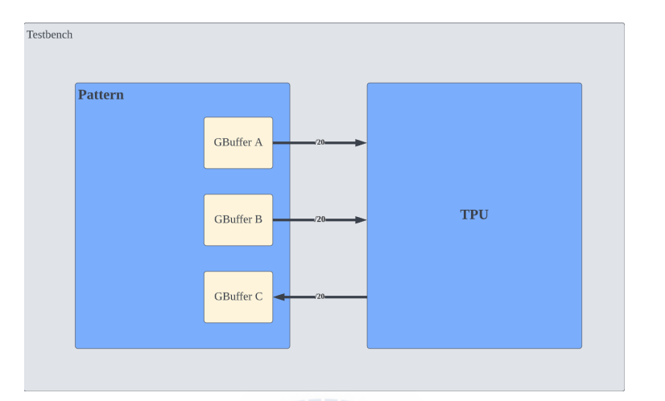
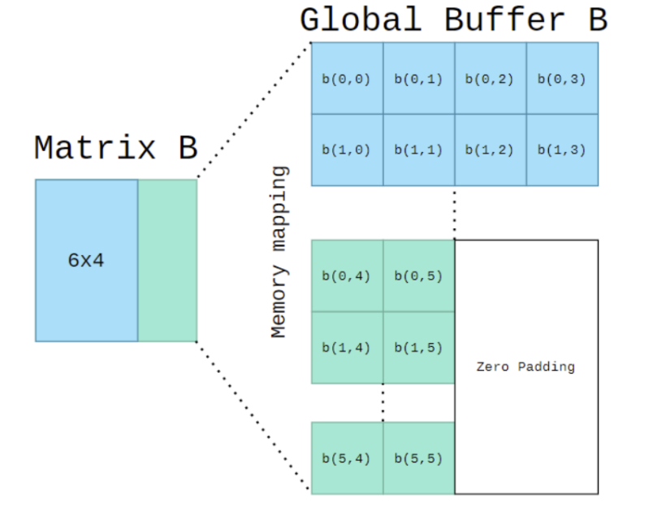

Lab3: Systolic array
====================

Goals of this lab
-----------------

-  `Basic Lab 1 Exercise -20% <#basic-lab-1-exercise-20>`__
-  `Basic Lab 2 Exercise -20% <#basic-lab-2-exercise-20>`__
-  `Basic Lab 3 Exercise -30% <#basic-lab-3-exercise-30>`__
-  `Advanced Lab 1 Exercise -30% <#advanced-lab-1-exercise-30>`__

Introduction
------------

The systolic array used by Google Tensor Processing Unit (TPU)
accelerates the matrix computation by using the dataflow operation. The
systolic array contains multiple processing elements (PEs), each of them
is responsible for the multiply–and-accumulate (MAC) operation. Unlike
the scalar CPU, the systolic array can performs multiple elements in a
matrix simultaneously and achieves high computational throughput.
Furthermore, the dataflow computing used by the systolic array stores
the reused data within the register of each PE and decreases the amount
of data movement between on-chip and off-chip memory.

In this Lab, we will use Verilog to implement the PE and a small
systolic array composed of 4 x 4 PEs. In addition, there is a lab that
will ask students to realize the dataflow stationary policy (weight and
output stationary) on the systolic array to perform matrix multiply
often used in AI models. (Hint: The weight stationary is more
complicated than output stationary.)

- Output Stationary 
- Weight Stationary

Intended Learning Outcomes
--------------------------

-  Understand the systolic array architecture and the dataflow used by
   the systolic array
-  Using the Verilog Programming to implement processing element (PE),
   and a 4 x 4 systolic array composed of the dataflow processing

Background
----------

The Google TPU uses 256 x 256 PE array to create a highly parallel
computing with 8-bit integer data type. The TPU outperforms current GPU
and CPU. It mainly accelerate the Matrix Multiply, so we will need to
implement the matrix multiply algorithm by using the systolic dataflow.

Let review the Matrix Multiply learning from senior high school. For
three matrix A(M,K), B(K,N) and C(M,N),that is, C = A ∗ B, Here is the
pseudo of MM algorithm that you already know.

.. code:: cpp

   for(int k = 0; k < K; k++) {
       for(int m = 0; m < M; m++) {
           for(int n = 0; n < N; n++) {
               C[m, n] += A[m, k] * B[k, n];
           }
       }
   }

Code 1: Matrix Multiplication in Weight Stationary

This particular dataflow is called a Weight-stationary dataflow, since
the weight element remain constant until the next row to be computed 

Systolic Array Implementation
-----------------------------

The goals of this lab are to familiarize
you with the concepts of dataflows in systolic array architectures. This
will get you hand-on experience with dataflow routing and processing
elements implementations. In this lab, you only need to construct the
TPU module.

Prerequisite
^^^^^^^^^^^^

-  Python3 with numpy library installed
-  iverilog or ncverilog or vivado
-  Makefile 

Requirements
^^^^^^^^^^^^

You need to perform Matrix multiplication
with one of dataflow stationary method with correct functional
simulation in 4x4 Processing elements(PEs). That is this design can
perform (4*K)*(K*4) 8-bit integer matrix multiplication.

1. Your design should be written in the Verilog language. There is no
   limitation in how you program your design.
2. Your PEs shouldn’t more than 4x4, where a 2D systolic array
   architecture is recommended.
3. An 8-bits input data, 32-bits accumulated data design. Please be
   careful with the bit-width problem.
4. (1024 + 256 ∗ 2) KiBytes in total of global buffer size.

Getting Started
^^^^^^^^^^^^^^^

This lab will require a beginner’s level of verilog.

.. hint::
   ``git clone https://github.com/nycu-caslab/AAML2023-Lab3.git``
   
Interface
^^^^^^^^^

Tabel 1: The control signals

+------------------+------------------+------------------+-------------+
| I/O              | Signal name      | Bit width        | Description |
+==================+==================+==================+=============+
| Input            | clk              | 1                | The clock   |
|                  |                  |                  | signal      |
+------------------+------------------+------------------+-------------+
| Input            | rst_n            | 1                | The reset   |
|                  |                  |                  | signal,     |
|                  |                  |                  | which is    |
|                  |                  |                  | active low. |
+------------------+------------------+------------------+-------------+
| Input            | in_valid         | 1                | The input   |
|                  |                  |                  | is valid    |
|                  |                  |                  | when        |
|                  |                  |                  | in_valid is |
|                  |                  |                  | high and    |
|                  |                  |                  | will only   |
|                  |                  |                  | high for    |
|                  |                  |                  | one cycle.  |
+------------------+------------------+------------------+-------------+
| Input            | K                | 8                | dimension K |
|                  |                  |                  | of the      |
|                  |                  |                  | matrix      |
|                  |                  |                  | (M,K),      |
|                  |                  |                  | (K,N)       |
+------------------+------------------+------------------+-------------+
| Input            | M                | 8                | dimension K |
|                  |                  |                  | of the      |
|                  |                  |                  | matrix      |
|                  |                  |                  | (M,K),      |
|                  |                  |                  | (K,N)       |
+------------------+------------------+------------------+-------------+
| Input            | N                | 8                | dimension K |
|                  |                  |                  | of the      |
|                  |                  |                  | matrix      |
|                  |                  |                  | (M,K),      |
|                  |                  |                  | (K,N)       |
+------------------+------------------+------------------+-------------+
| Output           | busy             | 1                | High when   |
|                  |                  |                  | the design  |
|                  |                  |                  | is busy.    |
|                  |                  |                  | Pattern     |
|                  |                  |                  | will check  |
|                  |                  |                  | your answer |
|                  |                  |                  | when busy   |
|                  |                  |                  | is low      |
|                  |                  |                  | after every |
|                  |                  |                  | in_valid.   |
+------------------+------------------+------------------+-------------+

Tabel 2: The SRAM interface of A and B SRAM

+--------+-------------+-----------+----------------------------------------------+
| I/O    | Signal name | Bit width | Description                                  |
+========+=============+===========+==============================================+
| Input  | wr_en       | 1         | The write enable signal.                     |
+--------+-------------+-----------+----------------------------------------------+
| Input  | index       | 16        | The address of the sram to be read or write. |
+--------+-------------+-----------+----------------------------------------------+
| Input  | data_in     | 32        | The data input to write to the SRAM          |
+--------+-------------+-----------+----------------------------------------------+
| Output | data_out    | 32        | The data output from the SRAM                |
+--------+-------------+-----------+----------------------------------------------+

Tabel 3: The SRAM interface of C SRAM

+--------+-------------+-----------+----------------------------------------------+
| I/O    | Signal name | Bit width | Description                                  |
+========+=============+===========+==============================================+
| Input  | wr_en       | 1         | The write enable signal.                     |
+--------+-------------+-----------+----------------------------------------------+
| Input  | index       | 16        | The address of the sram to be read or write. |
+--------+-------------+-----------+----------------------------------------------+
| Input  | data_in     | 128       | The data input to write to the SRAM          |
+--------+-------------+-----------+----------------------------------------------+
| Output | data_out    | 128       | The data output from the SRAM                |
+--------+-------------+-----------+----------------------------------------------+

Specification
^^^^^^^^^^^^^

Module Specification
""""""""""""""""""""

1.  Top module: TPU (filename: TPU.V)
2.  Input Pins: clk, rst_n, in_valid, K, M, N
3.  Output Pins: busy, [ABC]_wr_en, [ABC]_index, [ABC]_data_in,
    [ABC]_data_out 
    
Rules
"""""

1.  Your TPU design should be under the top module which provided by TA.
2.  Pattern module includes three global buffers prepared for your TPU.
    Two of the global buffers have its own read write port,
    256x256x32bit=256 KiBytes size and the final one for you to write
    back the data has 256x256x128bit=1024 KiBytes. For the detail of the
    mapping of matrix into global buffer. Please refer to the
    `Appendix <#appendix>`__ . There are two types of mapping. Type A
    for matrix A, and Type B for matrix B and C.
3.  At the start of the simulation, testbench will load the global
    buffer A & B, which assume that CPU or DMA has already prepared the
    data for TPU in global buffer. When signal in_valid==1, the size of
    the two matrices will be available for TPU (m, n, k) for only one
    cycle.
4.  Testbench will compare your output global buffer with golden, when
    you finish the calculation, that is (busy==0). Then you need to wait
    for the next in_valid for the next test case.
5.  You should implement your own data loader, process elements(PEs),
    and controller which schedule the data in global buffer A & B to be
    calculated in the systolic array.
6.  You need to **set busy to high immediately after in_valid fall from
    high to low**.
7. Cannot modify the name of input or output port.
8. Use **asynchronous reset active low** architecture
9. All your output register **should set to zero after reset**.
10. The execution latency is limited in **1500000** cycles.
11. Don’ t write Chinese comments or other language comments in the file
    you turned in.
12. Don’t use any wire/reg/submodule/parameter name called *error*,
    \*congratulation*, \*latch\* or \*fail\* otherwise you will fail the
    lab. Note: \* means any char in front of or behind the word. e.g:
    error_note is forbidden

Basic Lab 1 Exercise -20%
^^^^^^^^^^^^^^^^^^^^^^^^^

-  Objective:

   -  Designs of dataflow in TPU
   -  Data reuse method

-  Input:

   -  A matrix and B matrix which size are 2*2
   -  control signal(datail in table1,2,3)

-  Output:

   -  the 2*2 C matrix of A matrix \* B matrix

-  Steps:

   1. take data from global buffer
   2. use the data from global buffer to calculate with PEs
   3. output the result to C global buffer
   4. make verif1 10 test cases of A(2*2) \* B(2*2)

-  Validation

   -  type this in command line
   
   .. hint::
      nWave &

   -  check the waveform with nWave, and the waveform will be like `this <#example-waveform>`__

Basic Lab 2 Exercise -20%
^^^^^^^^^^^^^^^^^^^^^^^^^

-  input:

   -  A matrix and B matrix which size are 4*4
   -  control signal(datail in table1,2,3)

-  output:

   -  the 4*4 C matrix of A matrix \* B matrix

-  steps:

   1. refer to Basic Lab1
   2. make verif2 10 test cases of A(4*4) \* B(4*4) 
   
   
Basic Lab 3 Exercise -30%
^^^^^^^^^^^^^^^^^^^^^^^^^

-  input:

   -  A matrix and B matrix which size are 4*K and K*4 separately
   -  control signal(datail in table1,2,3)

-  output:

   -  the 4*4 C matrix of A matrix \* B matrix

-  steps:

   1. refer to Basic Lab1
   2. make verif3 10 test cases of A(4*K) \* B(K*4) 
   

Advanced Lab 1 Exercise -30%
^^^^^^^^^^^^^^^^^^^^^^^^^^^^

-  input:

   -  A matrix and B matrix which size are M*K and K*N separately
   -  control signal(datail in table1,2,3)

-  output:

   -  the M*N C matrix of A matrix \* B matrix

-  steps:

   1. refer to Basic Lab1
   2. make real 100 test cases of A(M*K) \* B(K*N), where M, K, N ∈ [4,
      256)

.. hint::

   Hint : you can take data and calculate at the same time or you will
   exceed cycles

Block digram
^^^^^^^^^^^^

Figure 1: Top Architecture

Example-Waveform
^^^^^^^^^^^^^^^^

.. image::
   ./images/ryu1TlHih.png

Figure 2: The example of input waveform

Appendix
^^^^^^^^

Memory Mapping - Type A(with transpose)
"""""""""""""""""""""""""""""""""""""""

.. image::
   ./images/S18IElrj2.png

Figure 3: Matrix mapping type A

Memory Mapping - Type B (without transpose)
"""""""""""""""""""""""""""""""""""""""""""

Figure 4: Matrix mapping type B

