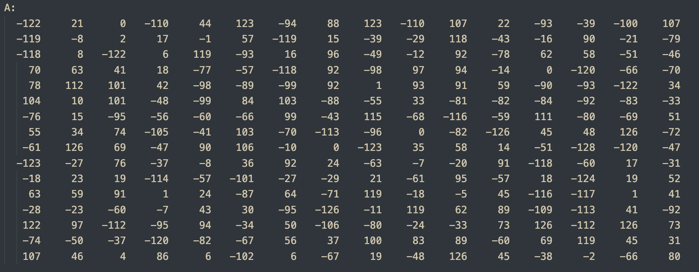
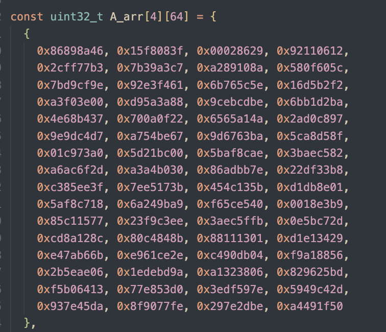

# Lab 5 : Systolic Array with im2col for Convolution

```{versionchanged} 11/17,23:40  
Corrected `wget` command in [im2col for Convolution](#im2col-for-convolution-20):
- Fixed an error in the previous version where `functional_cfu_tests.cc` was incorrectly get. Updated to get the correct file, `conv_test.cc`.
```

## Goal of this lab
---
- [Integrate Systolic Array to CFU Playground and Run Matmul - 20%](#integrate-systolic-array-to-cfu-playground-and-run-matmul-20)
- [im2col for Convolution - 20%](#im2col-for-convolution-20)
- [Get Everything Together - 50%](#get-everything-together-50)
- [Questions in the Demo - 10%](#questions-in-the-demo-10)

## Introduction
---
After finishing lab 3, the implementation of systolic array, we are going to integrate it into the CFU playground. As lab 3 focuses on the design of the circuit, in this lab, you will attempt to do SW-HW co-design to leverage your circuit for accelerating real-world applications.

To successfully integrate your systolic array into CFU-Playground, several modifications are required to make your design synthesizable and meet the necessary constraints. Additionally, you will develop a set of CFU operations that enable efficient communication between the CPU and the TPU for controlling your hardware.

Since the systolic array is designed for matrix multiplication, a technique known as im2col is essential to adapt it for accelerating 2D convolution operations by converting convolutions into matrix multiplications. You'll also need to implement it in this lab.

## Integrate Systolic Array to CFU Playground and Run Matmul - 20%
---

The matrix data needs to be transmitted from the CPU to the global buffers A and B in the CFU. Once all the required data has been gathered, then the TPU will start to compute this matrix data. The outcome of the computation will be preserved in the buffer C. Finally, the data stored in the buffer C will be written back to the CPU.


The key word spotting model we intend to accelerate uses int8, and since negative values occur during computation, we need to modify it to support operations with signed integers.

You may use the below command under the lab 3 directory `AAML2024-Lab3/` to make sure it can deal with ***signed*** int8 correctly.
```
$ make verif_signed
```
The pattern generator will generate 50 sets of two 16*16 matrix using int8 ∈ [-128, 128) and pass it to your systolic array and check the answers.


### Intergration and Verification - 20%

Now you are ready to do the intergration! Create a new project folder just like previous labs.

As shown in the block diagram, we will also be intergrating global buffer A, B and C into the CFU, we have provide a global buffer that utilises the BRAM resources of the FPGA instead of flip-flop, **please mind that this buffer does not have an async reset**.
```{important}
 [global_buffer_bram.v](https://raw.githubusercontent.com/nycu-caslab/AAML2024/refs/heads/main/lab5_util/global_buffer_bram.v) for the global buffer using BRAM and the example to instantiates it.

It's totally fine if you want to use something else instead of using this BRAM buffer and example, as long as you can integrate your systolic array to into the CFU and pass the tests.
```

After all the hardware coding and designing the `cfu_op` to pass and recieve data from your accelerator, it is nice to do some verification now, we have provide a test before you really dive into the complicated inferencing of the KWS model.

1. Run this command under the project directory to wget the golden test `functional_cfu_tests.cc` to your project
```
$ wget -P src/ https://github.com/nycu-caslab/AAML2024/raw/main/lab5_util/functional_cfu_tests.cc
```

2. `make clean`, `make prog EXTRA_LITEX_ARGS="--cpu-variant=perf+cfu"`, `make load` and enter `2: Functional CFU Tests` from the main menu, it shall look something like this:

```
Tests for Functional CFUs
=========================
 h: Matmul 16*16 int8 w/ pattern 1
 e: Matmul 16*16 int8 w/ pattern 2
 l: Matmul 16*16 int8 w/ pattern 3
 p: Matmul 16*16 int8 w/ pattern 4
 !: Matmul 16*16 int8 4096 times w/ 4 patterns rotating
 x: eXit to previous menu
```
`make clean` then `make prog EXTRA_LITEX_ARGS="--cpu-variant=perf+cfu"` if you don't see it.

3. Write the code about passing and recieving data to your accelerator from the software side in the `do_matmul_num` function of the `functional_cfu_tests.cc`.
```{important}
- All the pattern we use to test are 16*16 int8, that is, the M, N, K are all 16.
- The input layout are just like lab3.
- For the output, you are required to place it to a 2D 16*16 int32 matrix.
- We are using the `perf_counter` here, so make sure you `make prog EXTRA_LITEX_ARGS="--cpu-variant=perf+cfu"`.
- Or you might get stuck running patterns because you don't have the `perf_counters` enabled.
```
For example, the first test case in the test (matrix A and its memory layout are just like lab3):

    

matrix B and its memory layout (same as lab3):

   

the answer should be :


```c
void do_matmul_num(int test_num) {
  // place your answer in this array!
  uint32_t C_arr[16][16];

  // =====================================================
  // Implement your design here, 
  // and DO NOT MODIFY ANYTHING "ABOVE" THIS LINE !!
  // ===================================================== 

  /**
    All inputs are 16*16 signed int8 matrix, outputs are 16*16 signed int32.
    1. Pass data to CFU.
    2. Pass matrix parameters to CFU.
    3. Receive data from CFU and place it to `C_arr`.
  */ 

  // =====================================================
  // DO NOT MODIFY ANYTHING "BELOW" THIS LINE !!
  // =====================================================

  for (uint32_t i = 0; i < 16; i++) {
    for (uint32_t j = 0; j < 16; j++) {
      if (C_arr[i][j] != C_arr_ans[test_num][(i<<4)+j]) {
        error_ct++;
	printf("*** %ld error(s) @ pattern no. %d\n ---> golden C_arr[%02ld][%02ld] = %08lX, your C_arr[%02ld][%02ld] = %08lX\n",
          error_ct, test_num, i, j, C_arr_ans[test_num][(i<<4)+j], i, j, C_arr[i][j]);
      }
    }
  }
```
### Evaluation Criteria

If you successfully complete the final part [Get Everything Together](#get-everything-together-50), you will automatically receive the score for this section. However, if you are unable to complete the final part, you can test this section independently and still earn the score for it.

```{important} 
You will get **0%** if you can't pass the golden test or didn't meet the requirement, you have to pass the pattern below to get 20%.
```

| Passes pattern       | 4096 times 1-4 rotating|
| -------------------  | ------------- |
| cycle ct. requirement|  < 45M        |

## im2col for Convolution - 20%

Using the im2col technique, we can convert a 2D convolution operation into the multiplication of two matrices, which can then be efficiently accelerated by the systolic array.

To construct these two matrices, which we will refer to as the kernel matrix and the im2col matrix, you can refer to the article:
[Why GEMM is at the heart of deep learning](https://petewarden.com/2015/04/20/why-gemm-is-at-the-heart-of-deep-learning/)

Here is the core part I excerpted from the article:

> The first step is to turn the input from an image, which is effectively a 3D array, into a 2D array that we can treat like a matrix. Where each kernel is applied is a little three-dimensional cube within the image, and so we take each one of those cubes of input values and copy them out as a single column into a matrix. This is known as im2col, for image-to-column.  
  
Now you have the input image in matrix form, you do the same for each kernel’s weights, serializing the 3D cubes into rows as the second matrix for the multiplication. Here’s what the final GEMM looks like:  
  
Here ‘k’ is the number of values in each patch and kernel, so it’s kernel width * kernel height * depth. The resulting matrix is ‘Number of patches’ columns high, by ‘Number of kernel’ rows wide. This matrix is actually treated as a 3D array by subsequent operations, by taking the number of kernels dimension as the depth, and then splitting the patches back into rows and columns based on their original position in the input image.

```{note}
Other than the shapes of convolution, it is also crucial to handle parameters such as **stride, dilation and padding** correctly to ensure the matrices are constructed properly for the convolution.

For simplicity, in this lab, **you can ignore batch and group** parameters, assuming both are set to 1. This assumption will still allow you to pass all the required tests.
```

Also, you may have noticed that dynamic memory allocation, such as using new or malloc, is not supported in CFU-Playground. Therefore, we recommand declaring fixed-size arrays, for example:
```cpp
int8_t im2col[...][...];
int8_t kernel[...][...];
int32_t result[...][...];
``` 

Once the kernel matrix and im2col matrix are constructed, you can perform a simple matrix multiplication (naive GEMM) to verify your implementation in this part.

Afterward, you will need to reconstruct the output tensor from the result matrix. This process shares similar concepts with constructing the im2col and kernel matrices. Finally, don’t forget to apply post-processing to the tensor, such as quantization and bias addition.

Under your project directory, add the `conv.h` to your project and do your modification on the  `ConvPerChannel` function.
```sh
$ cp \
  ../../third_party/tflite-micro/tensorflow/lite/kernels/internal/reference/integer_ops/conv.h \
  src/tensorflow/lite/kernels/internal/reference/integer_ops/conv.h
```

Download the unit tests for testing your implementation under your lab5 project directory:
```sh
$ cd ${CFU_ROOT}/proj/lab5_proj
$ mkdir -p src/tensorflow/lite/micro/kernels
$ wget -P src/tensorflow/lite/micro/kernels \
  https://github.com/nycu-caslab/AAML2024/raw/main/lab5_util/conv_test.cc
$ wget -P src/ \
  https://github.com/nycu-caslab/AAML2024/raw/main/lab5_util/tflite_unit_tests.cc
```

### Evaluation Criteria

If you successfully complete the final part [Get Everything Together](#get-everything-together-50), you will automatically receive the score for this section. However, if you are unable to complete the final part, you can test this section independently and still earn the score for it.

To earn the score for this part, you need to perform the im2col transformation for the convolution. However, the matrix multiplication can be handled purely through software using a naive GEMM implementation. To pass, you must successfully complete the `TFLite Unit Tests` without any failures.  
```
CFU Playground
==============
 1: TfLM Models menu
 2: Functional CFU Tests
 3: Project menu
 4: Performance Counter Tests
>5: TFLite Unit Tests
 6: Benchmarks
 7: Util Tests
 8: Embench IoT
main> 5
```
```
12/12 tests passed
~~~ALL TESTS PASSED~~~
```

All 12 tests must be passed.

## Get Everything Together - 50%
Now you have a working systolic array that can do matmul correctly, and a im2col SW code for turning convolution into matmul, it's time to get everything together!

Since the the buffer size of systolic array is limited, you might need **tiling** for the matrix multiplication. If you are not familiar with it, you can refer to this article:  
[How to tile matrix multiplication](https://alvinwan.com/how-to-tile-matrix-multiplication/)

Here’s a simple example for you. Here, T represents the size of each tile, which you may want to set based on the buffer size. In addition to the outer loops, some inner loops may be required to manage the sending and receiving logic.
```cpp
constexpr int T; // tile size

for (int m = 0; m < pad_M; m += T) {
  for (int n = 0; n < pad_N; n += T) {
    for (int k = 0; k < pad_K; k += T) {
      // send to im2col buffer
      // send to kernel buffer
      // receive from output buffer
    }
  }
}
```

You may run into some boundary problems when padding. **Handle the values that are out of boundary correctly to achieve the correct result.**

Please note that there are `input_offset` when doing convolution, you may either modify the hardware to accumulate with the offset, or try any method as you see fit.

```
acc += filter_val * (input_val + `input_offset`)
```
````{important}
  Add the sixth perf counter at the beginning and end of the topmost `ConvPerChannel` function within the `conv.h` file in your project. This step is crucial for evaluating your score, so please ensure it is not overlooked.

```cpp
  // Fixed-point per-channel-quantization convolution reference kernel.
  inline void ConvPerChannel(
    const ConvParams& params, const int32_t* output_multiplier,
    const int32_t* output_shift, const RuntimeShape& input_shape,
    const int8_t* input_data, const RuntimeShape& filter_shape,
    const int8_t* filter_data, const RuntimeShape& bias_shape,
    const int32_t* bias_data, const RuntimeShape& output_shape,
    int8_t* output_data) {
    perf_enable_counter(6);

    ...

    perf_disable_counter(6);
  }
```
````

### Evaluation Criteria
We will test the performance of your implemetation base on the quantized KWS model provided in lab2. Note that your systolic array + im2col shall be faster than lab2's SIMD method, we will be running several labels to make sure you have done everything right. 

Also, to earn the score for this part, you still need to complete the `TFLite Unit Tests` without any failures.
```{important} 
You will get **0%** if you can't pass the `TFLite Unit Tests` or didn't meet the requirement.
```

| Cycles of Counter 6 | > 650M  | 650~550M  | 550~480M | < 480M |
| ------------------- | ------- | --------- |:-------- |:------ |
| Score               | 0       | 30        | 40       | 50     |


## Questions in the Demo - 10%
---
You will be asked several questions about the concepts covered in this lab and your implementation. This section accounts for 10% of the total lab score.


## Submission
---
You need to hand in your **CFU-Playground project folder** without the `build` folder and renamed with your student ID. 

Please organize your submission files into a zip archive structured as follows:
```
YourID.zip
    └── YourID/
        ├── src/
        │    ├── folder... 
        │    └── files...
        ├── cfu.v
        └── Makefile
```

```{important}
TAs should be able to run your project without any modification. If TAs cannot compile or run your code, **you won't receive any points, even if you passed the DEMO**. Also, **PLAGIARISM is not allowed**.
```
