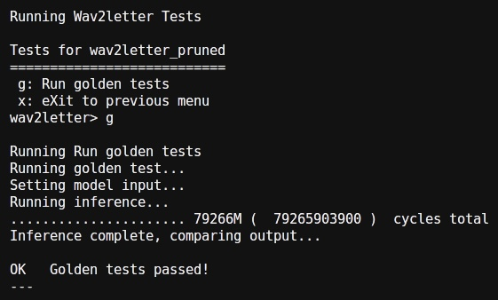
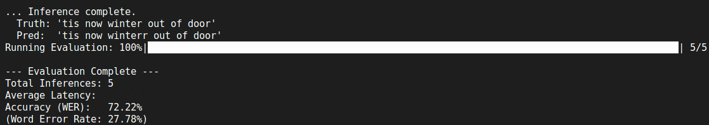

# Final Project: Pruned Wav2Letter

```{versionchanged} 2025/11/27,17:25
Template update:
- The template has been revised to fix an eval bug. If you have cloned the template before this announcement, please re-clone it.
```

## Introduction
----
In this final project, you are required to design a CFU to accelerate the Wav2Letter model for automatic speech recognition (ASR) tasks. The primary goal is to minimize inference latency while maintaining the model's accuracy.

### Selected Model
We use a quantized version of the Wav2Letter architecture. The default implementation, provided by Arm, is pruned to 50% sparsity and quantized using the TensorFlow Model Optimization Toolkit.

You don’t need to integrate the model yourself; it is already included in the CFU template. You can inspect the model architecture using [Netron](https://netron.app/). It might provide you some inspiration for your design.

```{note}
The model takes a long time (**>60 minutes**) to inference the full evaluation dataset using the pure software implementation. Please start your project as soon as possible.
```

## Setup
----
### Clone the Final Project Template
```bash
$ cd ${CFU_ROOT}/proj
$ git clone https://github.com/nycu-caslab/AAML-2025-Project.git
```

### Prepare the Model File
Download the original Wav2Letter tflite model:
```bash
$ cd AAML-2025-Project/src/wav2letter/model
$ wget https://github.com/ARM-software/ML-Zoo/raw/master/models/speech_recognition/wav2letter/tflite_pruned_int8/wav2letter_pruned_int8.tflite
```
Then convert the tflite file into a header file:
```bash
$ chmod +x model_convert.sh
$ ./model_convert.sh
```

### Python Dependencies
```bash
$ pip install numpy pyserial tqdm jiwer
```

## Requirements
----
### Files
- **Modifiable files**
    1. `src/tensorflow/lite/kernels/internal/reference/integer_ops/conv.h`
    2. `src/tensorflow/lite/kernels/internal/reference/leaky_relu.h`
    3. `cfu.v`
    4. The `.tflite` model file and the generated header file. (Only if you modify the architecture)
- **Custom files**
    - You can add any files you need to improve your design. 

```{important}
**DO NOT MODIFY** any other files in the template or in the source code under `${CFU_ROOT}/common/**` and `${CFU_ROOT}/third_party/**` unless permitted.
```

### Architecture
You can modify the model architecture. But your accuracy can not be less than **72%** (see [Grading Formula](#grading-formula)).

```{important}
You are **NOT ALLOWED** to retrain the model on the provided **test dataset** (overfitting). You must ensure your model generalizes well to unseen audio. If we find this situation happened, you will receive **0 points** on the final project.
```

### Golden Test
You can use the golden test to verify if your implementation gives the same results as the original model.
- How to run:
    1. `make prog && make load`
    2. Press `3` > `w` > `g` to run the golden test. The result should be like:
    

### Performance
We use a provided Python script to evaluate your design.
- Steps:
    1. `make prog && make load`
    2. Reboot the LiteX.
    3. **Close the litex-term terminal** (Critical! To free up the UART port).
    4. Run the script:
       ```bash
       $ python eval.py --port /dev/ttyUSB1 (or any serial you are using)
       ```
The result should be like:  


You need to minimize the latency as low as it could be.

```{Tip}
If you just want to check the latency of your design, it would be easier to run a test input instead of whole process of evaluation.
```

## Presentation
----
- You should give a presentation in the last class of this semester.
- **Time Limit:** At most **5 minutes** per team.
- **Content:**
    - **Introduction**: Strategy for SW profiling & HW architecture.
    - **Implementation**: Details of your CFU & kernel optimizations.
    - **Evaluation**: Final accuracy & latency.

```{important}
You will receive a **30-point deduction** if you do not present your work.
```

## Grading Policy
----
- Your performance will be compared against the TA’s baseline, implemented with only the SIMD approach from Lab 2. The baseline latency will **NOT** be released.
- **Ranking:** A leaderboard will be released after the deadline.

## Grading Formula
----
### Accuracy

\begin{gather*}
\text{ACC} = \begin{cases}
    1 & \text{if } {\text{ACC}_{\text{student}}} \text{≥ 72%} \\
    0 & \text{if } {\text{ACC}_{\text{student}}} \text{< 72%}
\end{cases}
\end{gather*}

```{Note}
Better accuracy (e.g., 90%) does **NOT** give you a higher score.
```

### Latency

\begin{gather*}
\text{LAT}_{\text{base}} = \min \left( 80 \times \frac{\text{LAT}_{\text{TA}}}{\text{LAT}_{\text{student}}}, 80 \right)
\end{gather*}

\begin{gather*}
\text{LAT}_{\text{rank}} = \min \left( 20 \times \frac{\#\text{students} - \text{Rank}_{\text{student}}}{\#\text{students}}, 20 \right) \\
\text{where } \text{Rank}_{\text{student}} \in [0, \#\text{students} - 1]
\end{gather*}

### Presentation

\begin{gather*}
\text{Present} = 
\begin{cases} 
    -30 & \text{if you submit a plain impl of Lab 2 OR do not present} \\
    -0 & \text{otherwise} 
\end{cases}
\end{gather*}

### Final score

\begin{gather*}
\text{Score} = 
\max \left( \text{ACC} \times (\text{LAT}_{\text{base}} + \text{LAT}_{\text{rank}} + \text{Present}), 0 \right) \
\\
(\text{Highest score} = 1 \times (80 + 20 - 0) = 100)
\end{gather*}

## Submission
----
- Please fork the repo and push your work to it.
    - If you use a custom model architecture, you **MUST** follow these steps:
        1. Explicitly state in README.md that you are using a custom model.
        2. Upload your modified `.tflite` file and the converted `.h` file under `src/wav2letter/model`.
        3. Also upload your training/modification scripts (if any) in the repo for verification.

- **Fill in your repo link and your presentation slides link to the spreadsheet before the deadline.**

- Grading workflow will be:
    1. Clone your repo.
    2. Apply your custom model (if specified in README.md).
    3. `make prog && make load`
    4. Run the evaluation script.
    5. Record the metrics.
